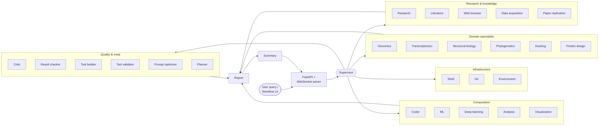

<div align="center">

# BioAgents

**A multi-agent AI system for computational biology research.**

[](#)
[](LICENSE)
[](https://www.python.org/downloads/)
[](https://github.com/langchain-ai/langgraph)
[](#-quickstart--docker-recommended)
[](https://github.com/astral-sh/uv)

</div>

BioAgents is a supervisor-orchestrated agent platform that chains 30+ specialist
agents — research, literature, protein design, genomics, transcriptomics,
docking, ML/DL, coder, and more — into reproducible computational-biology
workflows. It ships with a real-time web UI, a visual workflow builder,
sandboxed code execution, drug-discovery scenario graphs, and a full
benchmarking harness.

> Built as the BBM479 final-year project at Hacettepe University.

---

## Table of contents

- [Highlights](#-highlights)
- [Architecture](#-architecture)
- [Quickstart — Docker (recommended)](#-quickstart--docker-recommended)
- [Native install (uv / pip)](#-native-install-uv--pip)
- [Using BioAgents](#-using-bioagents)
- [Workflow presets](#-workflow-presets)
- [Drug-discovery pipeline](#-drug-discovery-pipeline)
- [Configuration reference](#-configuration-reference)
- [Repository layout](#-repository-layout)
- [Testing & development](#-testing--development)
- [Observability](#-observability)
- [Contributing](#-contributing)
- [Team](#-team)
- [License](#-license)

---

## ✨ Highlights

- **Multi-agent orchestration with LangGraph.** A central *supervisor*
  decomposes each query and hands control to the right specialist: research,
  literature, genomics, transcriptomics, structural biology, phylogenetics,
  docking, protein design, ML, deep learning, tool-builder, critic, report,
  and more — 30 agents in total.
- **Dynamic tool routing & policy.** A `ToolPolicy` gate approves safe tools
  automatically, routes risky calls through a user-approval prompt in the UI,
  and records every tool invocation for the audit log.
- **First-class web UI.** A FastAPI + HTMX/JS frontend streams agent
  reasoning, tool calls, artifacts, and 3D protein structures (NGL.js) over
  WebSockets with mid-run steering and approval prompts.
- **Visual workflow builder.** A drag-and-drop editor exposes a library of
  declarative pipelines (protein analysis, ESM-2 embedding, UniProt/RCSB
  lookups, drug-discovery scenarios A–D) with typed inputs and options.
- **Drug-discovery scenarios out of the box.** Four end-to-end graphs
  (disease-first, target-first, molecule-first, optimization-loop) wire
  upstream data sources into a shared design → docking → ADMET → off-target
  → retrosynthesis → gates → decision-log pipeline.
- **Sandboxed code execution.** Coder / ML / DL agents run generated code in
  either `smolagents.LocalPythonExecutor` (default, self-contained) or a
  nested `DockerExecutor` when the host Docker socket is mounted.
- **Multi-provider LLMs.** OpenAI, Google Gemini, and local Ollama models are
  all supported with per-provider rate limiting, retries, and timeouts.
- **Benchmarking & replay.** A use-case loader, experiment runner,
  persistent run artifacts, and an optional LLM-as-judge produce
  reproducible evaluations.
- **Docker-first deployment.** One command brings up the full stack (image
  includes Python 3.12, the uv-managed venv, Node.js 20, `rdkit-agent`, and
  RDKit Python bindings).

---

## 🧠 Architecture



A few components worth calling out:

- **`bioagents/graph.py`** wires the supervisor and its 30 specialists into
  one `StateGraph` with checkpointing, interrupt-driven approvals, and
  streaming.
- **`bioagents/workflows/`** hosts the declarative workflow engine. Nodes
  compose into graphs described in `preset_catalog.py`; the visual builder
  speaks the same schema.
- **`bioagents/sandbox/`** owns the code-execution boundary. The same API
  backs both the local and Docker executors.
- **`bioagents/tools/`** implements every tool that agents can call — from
  UniProt/PDB/AlphaFold fetchers to RDKit, ProteinMPNN, RFdiffusion,
  ToolUniverse MCP, BLAST wrappers, etc.
- **`frontend/`** is a vanilla JS + FastAPI single-page UI with a chat mode,
  a structure viewer, and a workflow builder.

---

## 🚀 Quickstart — Docker (recommended)

Prerequisites: Docker 24+ with the Compose v2 plugin (`docker compose`).

```bash
git clone https://github.com/mert-ergun/BioAgents.git
cd BioAgents
cp .env.template .env           # add at least one LLM API key
docker compose up --build       # web UI at http://localhost:8000
```

The image ships with:

- Python 3.12 + the uv-resolved virtualenv pinned from `uv.lock`
- Node.js 20 with the [`rdkit-agent`](https://www.npmjs.com/package/rdkit-agent)
  CLI on `PATH` (used by `bioagents.tools.rdkit_wrapper`)
- `rdkit`, `biopython`, and the full LangGraph / LangChain stack
- The Docker CLI (lets agents spawn nested sandbox containers when the host
  socket is mounted)
- A non-root `bioagents` runtime user and a health-checked `/health` probe

**Common Compose commands:**

```bash
docker compose up -d                 # run detached
docker compose logs -f bioagents     # tail logs
docker compose run --rm tests        # run the pytest suite inside the image
docker compose run --rm shell        # interactive bash with the venv active
docker compose down                  # stop the stack
docker compose down -v               # stop and wipe persisted volumes
```

Persistent state lives in named volumes (`artifacts`, `uploads`,
`experiments`, `sandbox`, `logs`, `cache`), so generated files survive
container restarts.

### Nested Docker sandboxing (optional)

By default code generated by the coder / ML / DL agents runs via
`smolagents.LocalPythonExecutor` inside the container
(`USE_LOCAL_EXECUTOR=true`). To opt into the nested `DockerExecutor` flow:

1. In `.env`, set `USE_LOCAL_EXECUTOR=false`.
2. In `docker-compose.yml`, uncomment the `/var/run/docker.sock` bind mount on
   the `bioagents` service.
3. Recreate the container: `docker compose up -d --force-recreate`.

> ⚠️ Mounting the host Docker socket grants root-equivalent access to the
> host. Only enable it in trusted environments.

### Manual `docker run`

```bash
docker build -t bioagents:latest .
docker run --rm -p 8000:8000 --env-file .env bioagents:latest
```

---

## 🧪 Native install (uv / pip)

For local development and contributors who want to iterate on the Python
code directly.

```bash
git clone https://github.com/mert-ergun/BioAgents.git
cd BioAgents

# Recommended: uv (auto-creates .venv, reproduces uv.lock)
uv sync --all-groups

# Alternative: pip (Python 3.12+)
python -m venv .venv && source .venv/bin/activate
pip install -r requirements.txt
```

The `rdkit-agent` Node CLI is **not** on PyPI — install it separately if you
want the cheminformatics tools:

```bash
npm install -g rdkit-agent    # requires Node.js ≥ 16
rdkit-agent --version
```

Configure environment variables:

```bash
cp .env.template .env
# Fill in at minimum:
#   LLM_PROVIDER=gemini|openai|ollama
#   GEMINI_API_KEY=... (or OPENAI_API_KEY, or OLLAMA_BASE_URL)
```

Run the web UI:

```bash
uv run bioagents-web              # serves http://localhost:8000
# or
uv run uvicorn frontend.server:app --reload
```

Run the reference CLI demo:

```bash
uv run python -m bioagents.main "Analyze the human p53 protein (P04637)."
```

---

## 💡 Using BioAgents

### 1. Web UI (`http://localhost:8000`)

- **Chat mode** — free-form queries dispatched through the full multi-agent
  graph. Streams reasoning, tool calls, artifacts, and protein structures in
  real time. Supports mid-run steering and tool-approval prompts.
- **Workflow builder** — drag-and-drop editor backed by the preset catalog
  (`GET /api/workflows/presets`). Pick an input type (UniProt ID, PDB ID,
  SMILES, FASTA, or raw text), tweak options, and run. Results land in the
  artifacts pane.
- **Experiments** — load YAML-defined use cases from `use_cases/`, run them
  in the background, and review scored outcomes from the run history.
- **Structure viewer** — any PDB path or URL mentioned by an agent is
  automatically rendered with NGL.js.

### 2. REST + WebSocket API

Selected endpoints exposed by `frontend/server.py`:

| Method | Path                                       | Purpose                                   |
| ------ | ------------------------------------------ | ----------------------------------------- |
| GET    | `/health`                                  | Liveness probe                            |
| POST   | `/api/query`                               | Run a query over SSE                      |
| WS     | `/ws`                                      | Streaming chat with steering & approvals |
| POST   | `/api/upload`                              | Upload a file for agent use               |
| GET    | `/api/agents` / `/api/agents/{name}`       | Browse the agent registry                 |
| GET    | `/api/tools/registry`                      | Browse dynamically created tools          |
| GET    | `/api/workflows/presets`                   | List workflow presets                     |
| POST   | `/api/workflows/run`                       | Execute a preset with inputs              |
| GET    | `/api/experiments/use-cases` / `/configs`  | Benchmark discovery                       |
| POST   | `/api/experiments/run`                     | Launch a background experiment            |
| GET    | `/api/experiments/runs/{run_id}`           | Fetch run results                         |
| GET    | `/api/demo/structure/{identifier}`         | Fetch AlphaFold/PDB structure             |
| GET    | `/api/sandbox/status`                      | Sandbox health                            |

### 3. Python library

```python
from langchain_core.messages import HumanMessage
from bioagents.graph import create_graph
from bioagents.graph_streaming import iter_graph_stream

graph = create_graph()
initial_state = {"messages": [HumanMessage(content="Fetch UniProt P04637 and summarize its domains.")]}

for step in iter_graph_stream(graph, initial_state):
    node = next(iter(step))
    print(f"→ {node}")
```

See `examples/` for end-to-end demos:

| Demo | What it shows |
| ---- | ------------- |
| `multi_agent_demo.py` | Full supervisor-driven graph on a p53 question |
| `research_agent_demo.py` | Research agent with UniProt/PDB tools |
| `coder_agent_interactive_demo.py` | Coder agent writing + executing code |
| `ml_agent_demo.py` | ML agent training on tabular bio data |
| `protein_binder_design_demo.py` | Protein design pipeline (RFdiffusion + ProteinMPNN) |
| `scientific_workflow_demo.py` | Declarative workflow via the preset catalog |
| `stella_benchmark_eval.py` | Benchmark harness on STELLA tasks |
| `tool_builder_demo.py` / `_2` | Dynamic tool creation |
| `tool_universe_agent_demo.py` | ToolUniverse MCP integration |
| `ace_integration_demo.py` | Adaptive Context Engine (self-evolving prompts) |

---

## 🧩 Workflow presets

Presets are declarative pipelines (`bioagents/workflows/preset_catalog.py`)
that the visual builder and the API both consume. The current catalog
includes:

- **Protein embedding** — UniProt → clean sequence → ESM-2 embedding
  (requires `uv sync --extra esm`), plus a zero-vector placeholder preset.
- **UniProt analytics** — FASTA export, cleaned sequence export, molecular
  weight, amino-acid composition, isoelectric point, hydrophobic /
  aromatic / charged fractions, reverse sequence, k-mer profiles (k = 2, 3,
  5 and configurable), residue counts, aliphatic / instability / GRAVY
  scores, terminal residues, compact biochem record.
- **PDB / RCSB** — entry summary (title, experimental method, resolution).
- **Drug discovery** — Scenario A (disease-first), B (target-first),
  C (molecule-first), D (optimization loop); see below.

Call `GET /api/workflows/presets` for the authoritative list with options
and required inputs.

---

## 💊 Drug-discovery pipeline

All four scenarios converge on the same downstream graph:

```
design → parallel{docking, Boltz} → ADMET → off-target → retrosynthesis
      → structure / docking / hit-screen / off-target / retrosynth / consensus gates
      → decision log (promotion tiers)
```

Entry points (configurable via the UI or `/api/workflows/run`):

| Scenario | Name              | Inputs                              |
| -------- | ----------------- | ----------------------------------- |
| A        | Disease-first     | `disease_id`, `target_uniprot`      |
| B        | Target-first      | `uniprot_id`                        |
| C        | Molecule-first    | `smiles`, `target_uniprot`          |
| D        | Optimization loop | `uniprot_id` (seeds auto-fetched)   |

Sources covered include UniProt, ChEMBL, BindingDB, Open Targets,
SwissTargetPrediction, KEGG, Reactome, STRING, PDB, and RCSB.

RDKit-backed chemistry (descriptors, PAINS, canonicalization, methyl-walk
enumeration) degrades gracefully when `rdkit` is not installed.

---

## ⚙️ Configuration reference

All variables live in `.env` (copy from `.env.template`). Only the LLM
provider block is required.

| Variable                       | Purpose                                                                        |
| ------------------------------ | ------------------------------------------------------------------------------ |
| `LLM_PROVIDER`                 | `openai` \| `gemini` \| `ollama`                                              |
| `OPENAI_API_KEY`               | OpenAI key (when `LLM_PROVIDER=openai`)                                       |
| `GEMINI_API_KEY`               | Google Gemini key (when `LLM_PROVIDER=gemini`)                                |
| `GEMINI_RATE_LIMIT`            | Max requests/sec to Gemini (default `5`)                                      |
| `OLLAMA_BASE_URL`              | Ollama OpenAI-compatible endpoint (default `http://localhost:11434/v1`)       |
| `BIOAGENTS_PORT`               | Host port for the web UI (default `8000`)                                     |
| `WEB_CONCURRENCY`              | Uvicorn workers (default `1`)                                                 |
| `USE_LOCAL_EXECUTOR`           | `true` → in-process sandbox; `false` → nested Docker (needs socket mount)     |
| `BIOAGENTS_SANDBOX_DIR`        | Sandbox working dir inside the container (default `/app/sandbox_workdir`)      |
| `LANGCHAIN_TRACING_V2`         | Enable LangSmith tracing (`true` / `false`)                                   |
| `LANGCHAIN_API_KEY`            | LangSmith API key                                                              |
| `LANGCHAIN_PROJECT`            | LangSmith project name (default `bioagents`)                                  |
| `BOLTZ_MCP_SERVER_HOST`        | Boltz ToolUniverse MCP endpoint (optional)                                    |
| `EXPERT_FEEDBACK_MCP_SERVER_URL` | Expert feedback MCP endpoint (optional)                                     |
| `HF_TOKEN`                     | Hugging Face token — needed for gated ESM-2 checkpoints                       |
| `TXAGENT_MCP_SERVER_HOST`      | TxAgent MCP endpoint (optional)                                               |
| `USPTO_API_KEY` / `USPTO_MCP_SERVER_HOST` | USPTO patent search (optional)                                   |
| `ACE_ENABLED`                  | Enable the Adaptive Context Engine (`true` / `false`, default `false`)        |
| `ACE_CURATOR_FREQUENCY`        | Curator cycle cadence when ACE is on (default `5`)                            |

---

## 🗂 Repository layout

```
BioAgents/
├── bioagents/                 # Core Python package
│   ├── agents/                # 30 specialist agents + supervisor
│   ├── graph.py               # LangGraph wiring (supervisor + agents + tools)
│   ├── graph_streaming.py     # Sync + async streaming helpers
│   ├── tools/                 # UniProt, PDB, AlphaFold, RDKit, BLAST, ToolUniverse…
│   ├── workflows/             # Declarative workflow engine
│   │   ├── drug_discovery/    # Scenarios A–D + shared nodes
│   │   ├── nodes/             # Reusable pipeline nodes (embeddings, analytics…)
│   │   └── preset_catalog.py  # Runnable preset definitions
│   ├── sandbox/               # Local + Docker code executors
│   ├── benchmarks/            # Experiment runner, judges, use-case loader
│   ├── learning/              # ACE (self-evolving) integration
│   ├── llms/                  # Provider abstraction, rate-limiting, LangSmith
│   ├── references/            # Citation / reference manager
│   └── main.py                # CLI entry point
├── frontend/                  # FastAPI + vanilla JS single-page UI
├── use_cases/                 # YAML benchmark use cases
├── playbooks/                 # Supervisor / research / tool-builder playbooks
├── examples/                  # End-to-end demos
├── tests/                     # Pytest suite (unit + integration)
├── docs/                      # ACE, prompt engineering, development guides
├── docker/                    # Container entrypoint
├── Dockerfile                 # Multi-stage build
├── docker-compose.yml         # Full-stack dev/prod stack
├── pyproject.toml / uv.lock   # Python deps
└── .env.template              # Config scaffold
```

Vendored repositories (`RFdiffusion/`, `ProteinMPNN/`, `DeepLearningExamples/`,
`DEEPScreen2/`, `ace/`) are excluded from the Docker image; they are
referenced only when the corresponding protein-design workflows are invoked.

---

## 🧪 Testing & development

```bash
make help              # list all targets
make dev-install       # uv sync --all-groups
make format            # ruff format + ruff check --fix
make lint              # ruff check
make type-check        # mypy bioagents
make security          # bandit -r bioagents
make test              # pytest
make test-coverage     # pytest with coverage HTML + terminal report
make all               # format + lint + type-check + security + test
make pre-commit-install
make pre-commit-run
```

Pre-commit hooks cover Ruff (lint + format), Bandit, Mypy, and the test
suite. See [`DEVELOPMENT.md`](DEVELOPMENT.md) for the full workflow.

To iterate with hot-reload:

```bash
uv run uvicorn frontend.server:app --reload --port 8000
```

---

## 📊 Observability

### LangSmith tracing

BioAgents emits traces for every agent step, tool call, and token usage
event. Enable it via `.env`:

```bash
LANGCHAIN_TRACING_V2=true
LANGCHAIN_API_KEY=ls__...
LANGCHAIN_PROJECT=bioagents
```

View runs at [smith.langchain.com](https://smith.langchain.com).

### Adaptive Context Engine (ACE)

When `ACE_ENABLED=true` the agents record successful / failed trajectories
and periodically curate their own prompts. See
[`docs/ACE_CONFIGURATION.md`](docs/ACE_CONFIGURATION.md) for details.

### Container health

The Docker image exposes a `GET /health` endpoint and a built-in
`HEALTHCHECK` so orchestrators can detect stuck containers.

---

## 🤝 Contributing

### Branching

- `main` — stable, production-ready; protected.
- `develop` — integration branch; always runnable.
- Feature work lives in `feature/*`, bug fixes in `fix/*`, docs in `docs/*`,
  chores in `chore/*` — always branched from `develop`.

### Commit style

[Conventional Commits](https://www.conventionalcommits.org/):
`<type>: <subject>` where type ∈ `feat | fix | docs | style | refactor |
test | chore`.

```bash
git commit -m "feat: add Scenario E (fragment-based design)"
git commit -m "fix(rdkit): guard against empty SMILES in canonicalization"
```

### Pull requests

1. Open an issue first and assign yourself.
2. Branch from `develop`; keep commits small and focused.
3. Ensure `make all` passes locally.
4. Open a PR into `develop` and link the issue with `Closes #<id>`.
5. Request a review — **do not self-merge**.

---

## 👥 Team

| Name                 | GitHub                                                   |
| -------------------- | -------------------------------------------------------- |
| Mert Ergun           | [@mert-ergun](https://github.com/mert-ergun)             |
| Arya Zeynep Mete     | [@aryazeynep](https://github.com/aryazeynep)             |
| Arın Dalahmetoğlu    | [@arindalahmetoglu](https://github.com/arindalahmetoglu) |

---

## 📜 License

BioAgents is released under the [MIT License](LICENSE).
